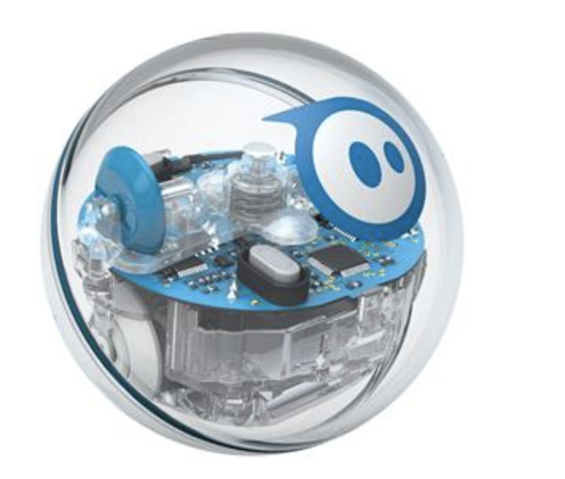
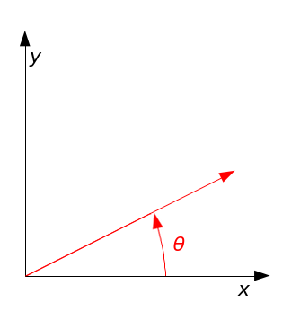

## Prep Activity: Learn to Control Sphero Programmatically

---

 

We're going to be playing with a <b>Sphero</b> robot on Make Day! The two activities in this repo are intended to give you some familiarity with Sphero's Javascript SDK. Since you probably don't have a Sphero at home, we'll use a mock library that will give you the basic idea.

 

If you want explore the SDK itself then have a look here: https://github.com/orbotix/sphero.js

<b>Cheat Sheet.</b> Below are the commands you'll be learning about:

* `sphero.connect`: Connects to Sphero. All your code goes inside this function.

* `sphero.roll`: Takes two arguments - distance (unitless) and direction (in degrees). The direction you specify is 0° relative to the x-axis - see the image below:

* `sphero.setColor`: Takes a string with the color as argument. In lower-case, e.g. "blue", "red", "green", etc.

* `sphero.getColor`: Returns Sphero's current color.

* `sphero.readOdometer`: We've cheated a little here! In the Sphero SDK the Odometer streams data asynchronously when invoking `streamOdometer`, while here we're just returning Sphero's position. We've included this function so you can get a little familiar with the concept.

<b>TIP:</b> See `example.js` for all of the commands required to finish the two activities.

### Activity #1

<i> Change Sphero's color and move him programmatically. </i>

* Open activity_1.js and add the required code so that Sphero's final position is at <b>(0, 200)</b> and it's color is <b>"Blue"</b>.

### Activity #2 (Optional)

<i> Sphero's initial position is randomized: Find Sphero's coordinates with the Odomoter and move him to <b>(0, 0)</b>. Send Sphero home! </i>

* Open `activity_2.js` and find Sphero's initial position.
* You have to send Sphero back to <b>(0, 0)</b>, so use the Odometer's reading and figure out a way to do that!